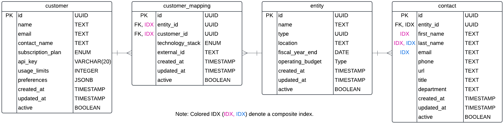
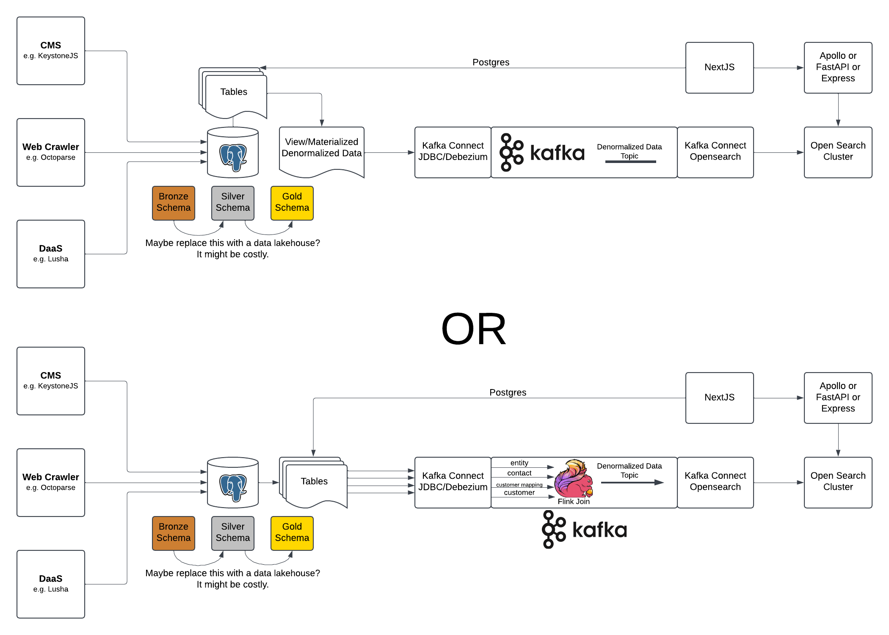

# Data Engineer Technical Assessment

This assessment involves designing a system to manage public sector contact and entity data, with a focus on schema design, indexing, and scalable search architecture while addressing customer-specific mappings. Additionally, it includes building a data pipeline to process sample data, load it into a database, and synchronize it with a search solution for efficient querying.

## Part 1: System Design

#### Schema Diagram



#### Exploring the Normalization-Denormalization Spectrum

To evaluate the tradeoffs between normalized and denormalized data in a database, it is essential to consider the needs of both data producers and consumers. Producers, such as crawlers, data entry specialists, or DaaS providers offering aggregated data, influence how the data is structured and ingested.

Crawlers typically output data in flat formats such as CSVs or JSON arrays, which do not enforce normalization rules; as a result, their output is usually denormalized. Similarly, DaaS providers offering aggregated data often deliver data in a flattened structure to ensure ease of consumption and consistency across diverse datasets. On the other hand, data entry specialists typically work with normalized data, as it is structured to organize information in a relational and consistent manner.

Consumers also influence how data is structured and exported. For instance, platforms like OpenSearch are optimized to work best with denormalized, semi-structured data.

For the Pursuits use case, I recommend adhering to essential RDBMS integrity rules, such as referential integrity, cascade behavior, and relational join validity. However, I would also strategically apply selective denormalization to the schema where it makes sense, to optimize both performance and usability. This approach ensures that our data producers do not face unnecessary difficulty when inserting data into the database.

For our use case, I would recommend adopting a more strategic and selective denormalized schema. While this approach offers advantages in terms of query performance and simplicity for certain read-heavy operations, it comes with trade-offs. These include increased complexity in write and update operations, a heightened risk of data inconsistencies due to duplication, and the need to compensate for the loss of built-in integrity checks typically provided by relational databases, such as referential integrity, cascade behavior, and relational join validity tests.

#### Indexing Strategy

##### Postgres Indexes

The primary purpose of creating indexes in PostgreSQL is to enhance the performance of queries, particularly for operations that producers interact with frequently within the schema. For instance, when a DaaS (Data-as-a-Service) provider loads a batch of data into PostgreSQL, indexes can significantly optimize integrity checks that involve joining tables and verifying the absence of NULL values.

A secondary purpose of creating indexes in Postgres is to enable efficient retrieval of additional information about specific records, particularly when certain details are not stored in the corresponding OpenSearch document. For example, storing `contact.url` in an OpenSearch document may not be practical. Instead, the document could include `contact.last_name` and `contact.email`, which can then be used to perform a secondary query to PostgreSQL to fetch a list of  `contact.url` when needed.

##### Opensearch Indexes

Only searchable or filterable fields, optionally accompanied by their record IDs, should be indexed in OpenSearch. These IDs can then be used for secondary queries in PostgreSQL to fetch additional details.

```json
{
  "mappings": {
    "properties": {
      "customer_id": { "type": "keyword" },
      "customer_mappings": {
        "type": "nested",
        "properties": {
          "technology_stack": { "type": "keyword" },
          "external_id": { "type": "keyword" }
        }
      },
      "entity": {
        "type": "object",
        "properties": {
          "id": { "type": "keyword" },
          "name": { "type": "text", "fields": { "raw": { "type": "keyword" } } },
          "type": { "type": "keyword" },
          "location": { "type": "text" },
          "fiscal_year_end": { "type": "date" },
          "operating_budget": { "type": "double" }
        }
      },
      "contact": {
        "type": "nested",
        "properties": {
          "id": { "type": "keyword" },
          "first_name": { "type": "text", "fields": { "raw": { "type": "keyword" } } },
          "last_name": { "type": "text", "fields": { "raw": { "type": "keyword" } } },
          "email": { "type": "keyword" },
          "phone": { "type": "keyword" },
          "department": { "type": "text" },
          "title": { "type": "text" }
        }
      }
    }
  }
}

```

###### Search Architecture



###### Performance Considerations

* Creating a materialized view in Postgres requires manual refreshes for keeping it up to date.
* By utilizing a view and a cursor in PostgreSQL, you can stream fully joined records while the join operation is still in progress. With JDBC Kafka Connect, you can configure your cursor and leverage the JDBC Kafka Connect timestamp mode, enabling near real-time data streaming.
* Consider Postgres table partitioning for faster queries
* For Debezium consider incremental snapshots vs full-table snapshots

###### Tradeoff Discussions

Tradeoffs are typically between system complexity, speed, integrity, and flexability/agility. 
